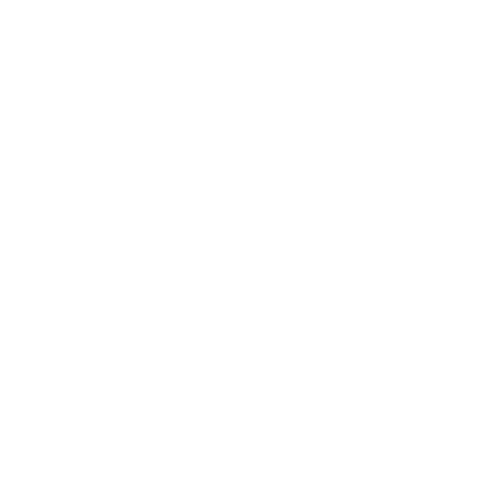
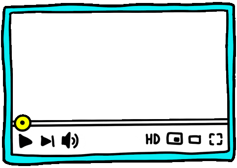

# Hola, soy Isaac Castillo 👋

       
    

## 💻 Backend | Frontend | Móvil

🚀 Transformando ideas en código y creando experiencias digitales impactantes.

### Lo que hago:
- Desarrollo Backend con [tecnologías favoritas].
- Diseño y construyo interfaces Frontend intuitivas y atractivas.
- Exploro el mundo del desarrollo móvil para expandir mis habilidades.

### Mis Objetivos:
- Aprender continuamente y mantenerme al tanto de las últimas tecnologías.
- Contribuir a proyectos emocionantes y colaborar con mentes creativas.
- Compartir conocimientos y ayudar a la comunidad de desarrolladores.

¡Vamos a construir algo increíble juntos! 🌐✨

## &#x1f4c8; Estadísticas de GitHub

## 💼 Habilidades

 

 
 

 

> "No hay soluciones fáciles, solo soluciones que no hemos descubierto todavía"  
> — [Keith DeRose]

 

<h3> 
🎉¡Gracias por visitar mi perfil de GitHub! 🎉</h3>

